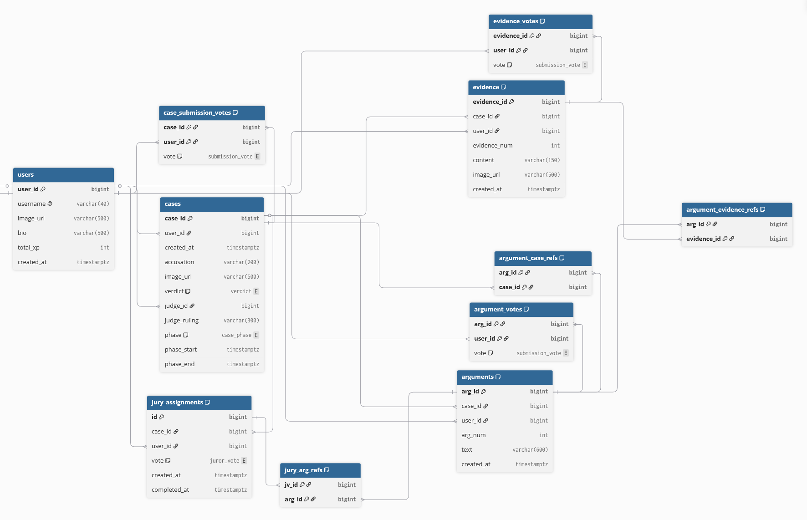
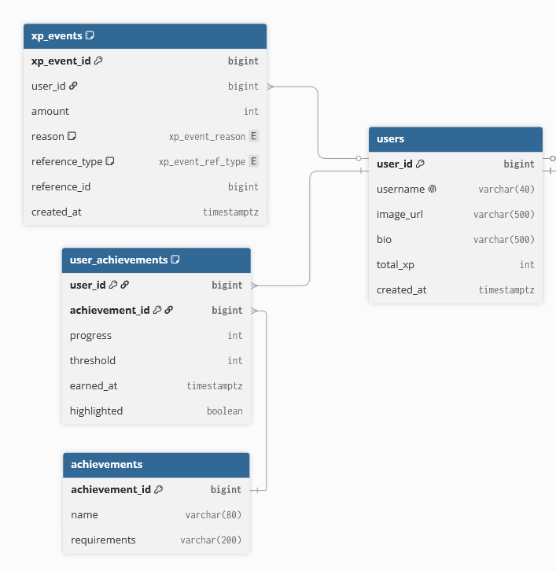

# Entity Relationship Diagram

Reference the Creating an Entity Relationship Diagram final project guide in the course portal for more information about how to complete this deliverable.

## Create the List of Tables

- **users** — registered members who submit cases, evidence, arguments, and votes
- **cases** — an accusation brought against an object, progressing through phases toward a verdict
- **evidence** — evidence items submitted to a case
- **arguments** — arguments submitted to a case
- **argument_case_refs** — precedent cases referenced within an argument (join)
- **argument_evidence_refs** — evidence items referenced within an argument (join)
- **case_submission_votes** — up/down votes on whether a case should advance
- **evidence_votes** — up/down votes on evidence items
- **argument_votes** — up/down votes on arguments
- **jury_arg_refs** — arguments a juror found most convincing for their vote (join)
- **jury_assignments** — assignment of a user to serve as juror on a case + juror's guilty/not-guilty verdict vote
- **xp_events** — individual XP-awarding events for a user
- **achievements** — catalog of earnable achievements
- **user_achievements** — a user's progress toward / earning of an achievement

### Enumerated Types

| Enum | Values |
|------|--------|
| `submission_vote` | `UP`, `DOWN` |
| `case_phase` | `PROVISIONAL`, `DISCOVERY`, `ARGUMENT`, `JURY_DELIBERATION`, `RULING`, `CLOSED` |
| `juror_vote` | `GUILTY`, `NOT_GUILTY`, `INSUFFICIENT_EVIDENCE` |
| `verdict` | `GUILTY`, `NOT_GUILTY`, `TB_PECKED_AT` |
| `xp_event_reason` | `SUBMISSION`, `JURY_VOTE`, `CASE_ADVANCED_TO_TRIAL`, `SUBMISSION_VOTE`, `SUBMISSION_CITED` |
| `xp_event_ref_type` | `CASE`, `EVIDENCE`, `ARGUMENT`, `VOTE` |

## Entity Relationship Diagram
core   

achievements  

Each table is outlined below.

### users

| Column Name | Type | Description |
|-------------|------|-------------|
| user_id | PK | primary key |
| username | VARCHAR(40) | unique display name (UNIQUE) |
| image_url | VARCHAR(500) | profile image |
| bio | VARCHAR(500) | user bio |
| total_xp | INT | cached total XP |
| created_at | TIMESTAMPTZ | account creation time |
| flair | FK → achievements | achievement shown by username outside of profile |

### cases

| Column Name | Type | Description |
|-------------|------|-------------|
| case_id | PK | primary key |
| user_id | FK → users | submitted by |
| created_at | TIMESTAMPTZ | submission time |
| object_name | VARCHAR(60) | name of the accused object |
| accusation | VARCHAR(250) | the accusation |
| image_url | VARCHAR(500) | image of the accused object |
| verdict | ENUM (`verdict`) | GUILTY, NOT_GUILTY, TB_PECKED_AT (if votes don't meet threshold) |
| judge_id | FK → users | assigned judge |
| judge_ruling | VARCHAR(300) | object designation based on verdict |
| phase | ENUM (`case_phase`) | PROVISIONAL, DISCOVERY, ARGUMENT, JURY_DELIBERATION, RULING, CLOSED |
| phase_start | TIMESTAMPTZ | start of current phase |
| phase_end | TIMESTAMPTZ | end of current phase |

### evidence

| Column Name | Type | Description |
|-------------|------|-------------|
| evidence_id | PK | primary key |
| case_id | FK → cases | parent case |
| user_id | FK → users | submitted by |
| evidence_num | INT | case-relative number for citation in arguments, generated on backend |
| text | VARCHAR(150) | evidence text |
| image_url | VARCHAR(500) | evidence image |
| created_at | TIMESTAMPTZ | submission time |
| | | UNIQUE(case_id, evidence_num) |

### arguments

| Column Name | Type | Description |
|-------------|------|-------------|
| arg_id | PK | primary key |
| case_id | FK → cases | parent case |
| user_id | FK → users | submitted by |
| arg_num | INT | case-relative number for citation by jurors |
| text | VARCHAR(600) | argument text |
| created_at | TIMESTAMPTZ | submission time |
| | | UNIQUE(case_id, arg_num) |

### argument_case_refs

| Column Name | Type | Description |
|-------------|------|-------------|
| arg_id | FK → arguments | referencing argument |
| case_id | FK → cases | precedent verdict referenced in argument |
| | | PRIMARY KEY(arg_id, case_id) |

### argument_evidence_refs

| Column Name | Type | Description |
|-------------|------|-------------|
| arg_id | FK → arguments | referencing argument |
| evidence_id | FK → evidence | evidence from the current case referenced in argument |
| | | PRIMARY KEY(arg_id, evidence_id) |

### case_submission_votes

| Column Name | Type | Description |
|-------------|------|-------------|
| case_id | FK → cases | voted-on case |
| user_id | FK → users | voter |
| vote | ENUM (`submission_vote`) | UP, DOWN |
| | | PRIMARY KEY(case_id, user_id) |

### evidence_votes

| Column Name | Type | Description |
|-------------|------|-------------|
| evidence_id | FK → evidence | voted-on evidence |
| user_id | FK → users | voter |
| vote | ENUM (`submission_vote`) | UP, DOWN |
| | | PRIMARY KEY(evidence_id, user_id) |

### argument_votes

| Column Name | Type | Description |
|-------------|------|-------------|
| arg_id | FK → arguments | voted-on argument |
| user_id | FK → users | voter |
| vote | ENUM (`submission_vote`) | UP, DOWN |
| | | PRIMARY KEY(arg_id, user_id) |

### jury_assignments

| Column Name | Type | Description |
|-------------|------|-------------|
| id | PK | primary key |
| case_id | FK → cases | assigned case |
| user_id | FK → users | assigned juror |
| vote | ENUM (`juror_vote`) | GUILTY, NOT_GUILTY, INSUFFICIENT_EVIDENCE |
| created_at | TIMESTAMPTZ | assignment time |
| completed_at | TIMESTAMPTZ | when the juror completed their vote |
| | | UNIQUE(case_id, user_id) |

### jury_arg_refs

| Column Name | Type | Description |
|-------------|------|-------------|
| jv_id | FK → jury_assignments(id) | the jury assignment / vote |
| arg_id | FK → arguments | argument selected as most convincing (can select multiple) |
| | | PRIMARY KEY(jv_id, arg_id) |

### xp_events

| Column Name | Type | Description |
|-------------|------|-------------|
| xp_event_id | PK | primary key |
| user_id | FK → users | user who earned the XP |
| amount | INT | XP awarded |
| reason | ENUM (`xp_event_reason`) | SUBMISSION, JURY_VOTE, CASE_ADVANCED_TO_TRIAL, SUBMISSION_VOTE, SUBMISSION_CITED |
| reference_type | ENUM (`xp_event_ref_type`) | CASE, EVIDENCE, ARGUMENT, VOTE |
| reference_id | BIGINT | ID of the object that caused the XP |
| created_at | TIMESTAMPTZ | event time |
| | | UNIQUE(user_id, reason, reference_type, reference_id) |

### achievements

| Column Name | Type | Description |
|-------------|------|-------------|
| achievement_id | PK | primary key |
| name | VARCHAR(80) | achievement name |
| requirements | VARCHAR(120) | description shown to users |
| threshold | INT | required count to earn |

### user_achievements

| Column Name | Type | Description |
|-------------|------|-------------|
| user_id | FK → users | user |
| achievement_id | FK → achievements | achievement |
| progress | INT | current progress for repeat-action achievements |
| earned_at | TIMESTAMPTZ | when earned |
