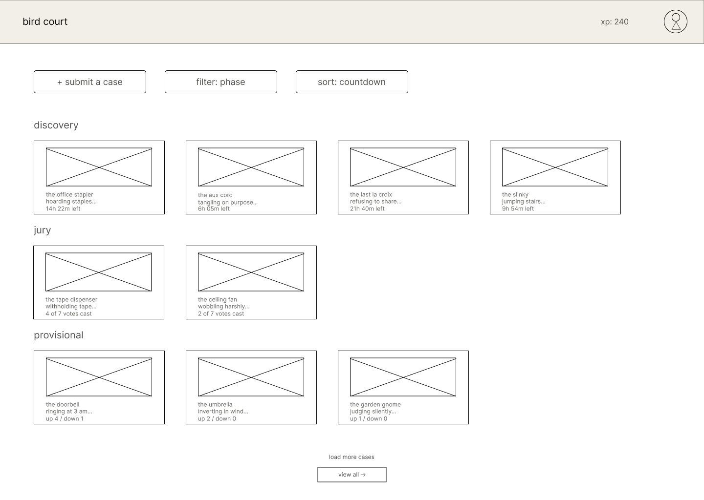
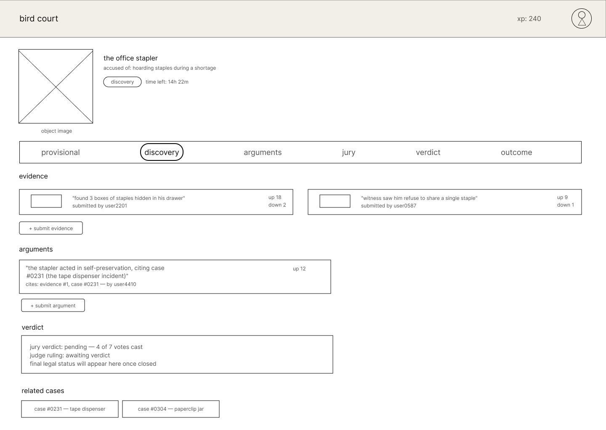
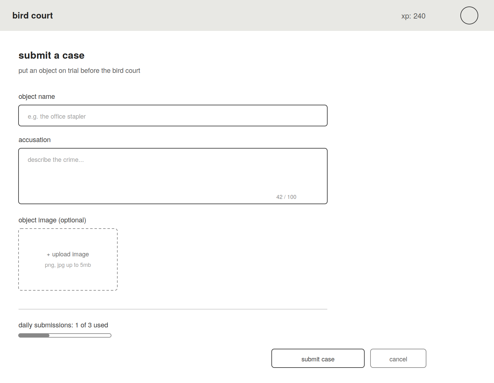
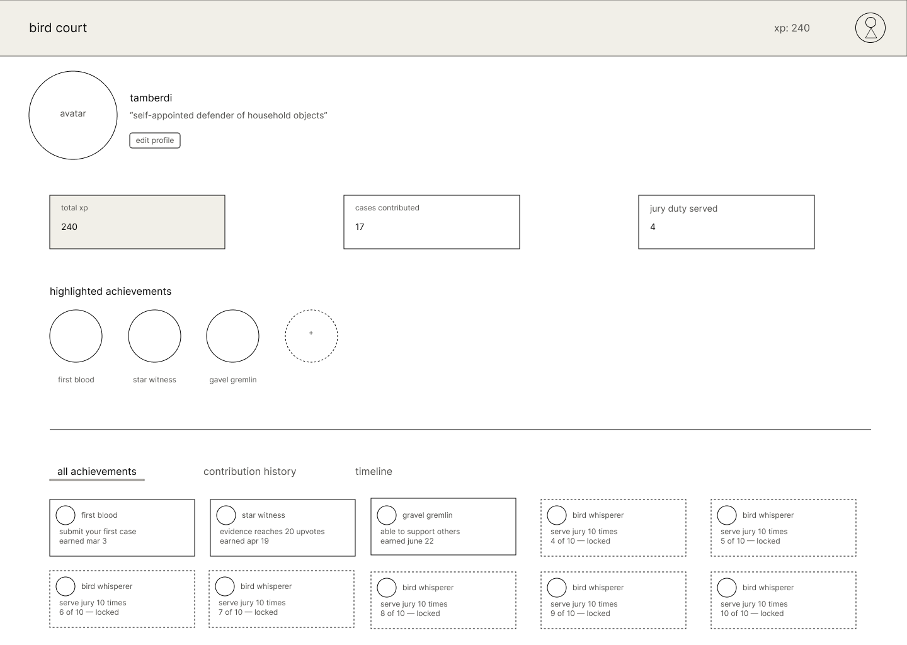

# Wireframes

Reference the Creating an Entity Relationship Diagram final project guide in the course portal for more information about how to complete this deliverable.

## List of Pages

- Case Directory (homepage) ⭐
- Case Detail Page ⭐
- Submission Form (case / evidence / argument) ⭐
- User Profile ⭐
- Jury Duty Page 

## Wireframe 1: Case Directory (homepage)

## Wireframe 2: Case Detail Page

## Wireframe 3: Submission Form

## Wireframe 4: User Profile

